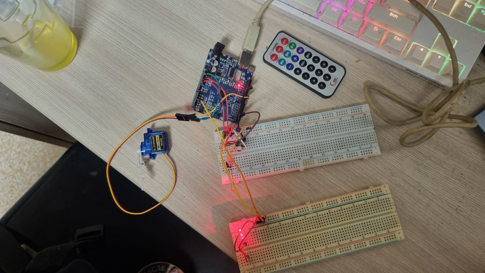
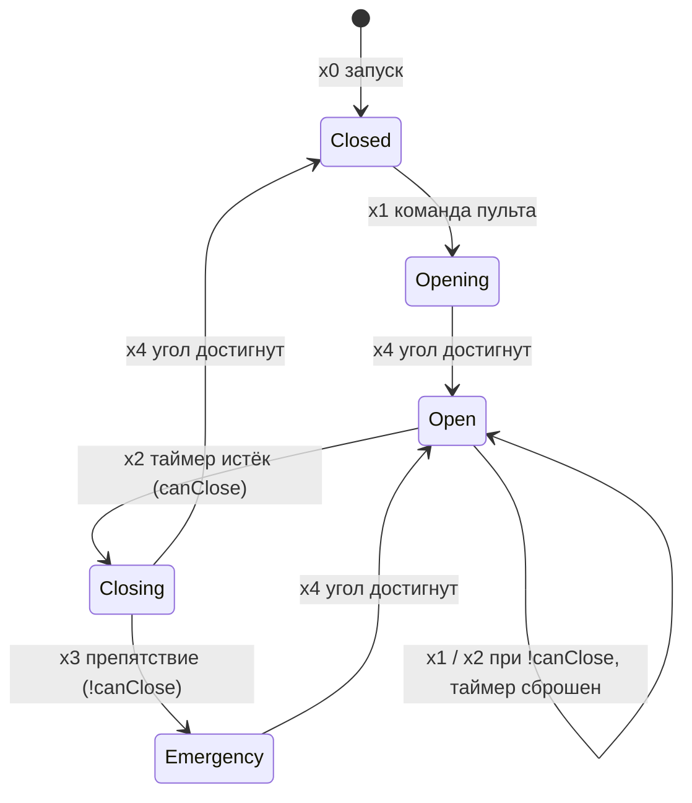

# Шлагбаум на Arduino Uno с управлением через ДКА

[](../../actions/workflows/compile.yml)

Курсовой проект по дисциплине «Микропроцессорные системы»
(Самарский государственный технический университет, Институт автоматики и информационных технологий, 2025).

Модель транспортного шлагбаума на **Arduino Uno R3**. Стрелой управляет сервопривод, а логика работы описана **детерминированным конечным автоматом**: у каждого состояния и перехода есть однозначное условие. Шлагбаум открывается по команде с ИК-пульта, закрывается сам по таймеру, а при обнаружении препятствия аварийно открывается на повышенной скорости.

<p align="center">
  
</p>

## Возможности

- Открытие по любой кнопке ИК-пульта (приёмник 1838).
- Плавный ход сервопривода 0° ↔ 90° (шаг 1°, задержка 20 мс).
- Автозакрытие через 5 с после открытия, если датчик это разрешает.
- Аварийное открытие: если во время закрытия появляется препятствие, стрела быстро поднимается (задержка шага 5 мс). Аварийное открытие приоритетнее закрытия.
- Фоторезистор с гистерезисом (150 / 200), чтобы не было ложных срабатываний.
- Светодиод на пине 13 мигает во время движения и гаснет в покое.
- После каждого движения сервопривод отключается (`detach`): он не греется и не дрожит.
- Диагностика в Serial Monitor (9600 бод): `[IR]`, `[MOVE]`, `[AUTO]`, `[EMERGENCY]`.

## Состав схемы

| Компонент | Подключение |
|---|---|
| Arduino Uno R3 | — |
| Сервопривод | сигнал → **D9**, +5 В, GND |
| ИК-приёмник 1838 | OUT → **D2**, +5 В, GND |
| Фоторезистор | делитель с резистором 10 кОм → **A3** |
| Светодиод статуса | **D13** через резистор 220–330 Ом |
| Второй светодиод (аварийная индикация) | в скетче не используется |
| ИК-пульт, макетная плата, провода | — |

Схемы: [Fritzing](docs/images/wiring-fritzing.png), [принципиальная](docs/images/schematic.png). Подробнее в [docs/hardware.md](docs/hardware.md).

## Состояния автомата



Таблица переходов и описание событий лежат в [docs/state-machine.md](docs/state-machine.md).

## Сборка и прошивка

1. Установите [Arduino IDE](https://www.arduino.cc/en/software) 1.8 или новее.
2. В менеджере библиотек поставьте **IRremote** (версия 4.x, нужен API `IrReceiver`). Библиотека **Servo** входит в комплект IDE.
3. Откройте `src/barrier/barrier.ino`, выберите плату *Arduino Uno* и загрузите скетч.
4. Откройте Serial Monitor на 9600 бод и нажмите кнопку на пульте.

Через Arduino CLI:

```bash
arduino-cli lib install IRremote Servo
arduino-cli compile --fqbn arduino:avr:uno src/barrier
arduino-cli upload  --fqbn arduino:avr:uno -p /dev/ttyACM0 src/barrier
```

## Параметры

Все константы лежат в начале `src/barrier/barrier.ino`:

| Константа | Значение | Смысл |
|---|---|---|
| `SERVO_OPEN` / `SERVO_CLOSE` | 90 / 0 | углы стрелы |
| `AUTO_CLOSE_DELAY` | 5000 мс | задержка автозакрытия |
| `LIGHT_CAN_CLOSE` | 150 | при значении ≤ 150 закрытие разрешено |
| `LIGHT_CANNOT_CLOSE` | 200 | при значении ≥ 200 закрытие запрещено |
| `SERVO_STEP_DELAY_NORMAL` / `_FAST` | 20 / 5 мс | скорость хода обычная / аварийная |
| `LED_BLINK_INTERVAL` | 150 мс | период мигания светодиода |

## Тесты

В `tests/servo_test/` лежит скетч для проверки сервопривода отдельно от остальной схемы: он гоняет вал 0° ↔ 90° и выводит угол в Serial. План ручного тестирования описан в [docs/testing.md](docs/testing.md).

## Структура репозитория

```
├── src/barrier/barrier.ino      основной скетч
├── tests/servo_test/            тест сервопривода
├── docs/
│   ├── report.docx              полный текст курсовой работы
│   ├── state-machine.md         ДКА, таблица переходов
│   ├── hardware.md              комплектующие и подключение
│   ├── testing.md               методика тестирования
│   └── images/                  схемы и фотографии
└── .github/workflows/           проверка компиляции скетчей
```

## Известные особенности

- `IrReceiver.begin(IR_PIN, ENABLE_LED_FEEDBACK)` включает обратную связь на встроенном светодиоде (`LED_BUILTIN`, на Uno это тоже пин 13). Он совпадает с `STATUS_LED`, поэтому светодиод может мигать и при приёме ИК-сигнала. Чтобы это отключить, замените на `DISABLE_LED_FEEDBACK`.
- Скетч реагирует на **любой** принятый ИК-сигнал, команды конкретных кнопок не разбираются.
- Полярность фоторезистора зависит от схемы делителя. Если закрытие блокируется не тогда, когда нужно, проверьте значения в Serial Monitor и поменяйте пороги.

## Демонстрация

Видео работы: _ссылка будет добавлена_.

## Источники

1. [Начало работы с Ардуино](https://doc.arduino.ua/ru/guide/)
2. [Справочник по языку Arduino](http://arduino.ru/Reference)
3. [ИК-приёмник VS1838B и Arduino](https://vk-book.ru/ik-priemnik-vs1838b-i-arduino/)
4. [Подключение фоторезистора к Arduino](https://portal-pk.ru/news/273-27-podklyuchenie-fotorezistora-k-arduino.html)
5. [Сервоприводы и Arduino](https://wiki.iarduino.ru/page/servo-guide-arduino/)

## Автор

Е.А. Салюков, студент группы 4-ИАИТ-103. Руководитель: О.В. Прохорова.

Лицензия: [MIT](LICENSE).
