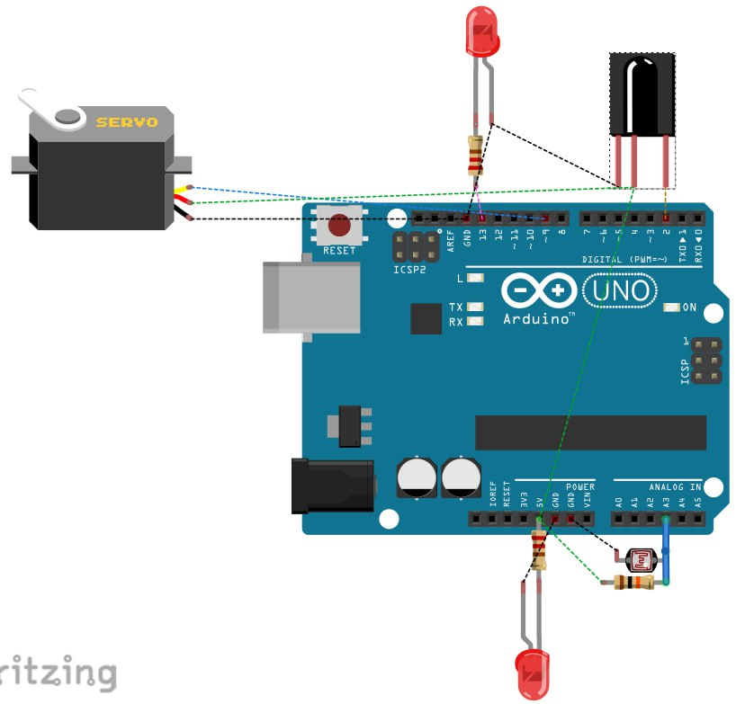
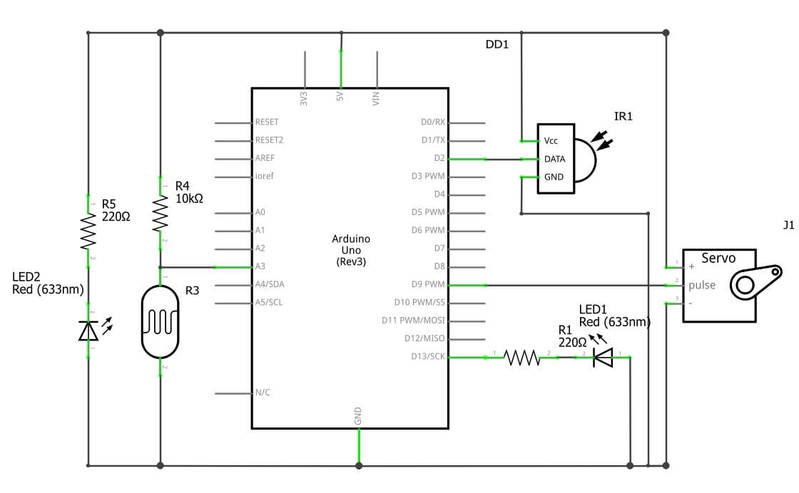

# Аппаратная часть

## Комплектующие

| Компонент | Назначение |
|---|---|
| Arduino UNO R3 (ATmega328P, 16 МГц) | управляющий контроллер |
| Сервопривод, 0–180°, 5 В | стрела шлагбаума: 0° закрыта, 90° открыта |
| ИК-приёмник 1838 (38 кГц) | приём команд с пульта, выход активный LOW |
| ИК-пульт | команда на открытие |
| Фоторезистор + резистор 10 кОм | датчик освещённости и препятствия (делитель на A3) |
| Светодиоды, 2 шт., резисторы 220–330 Ом | индикация движения и состояния |
| Макетная плата, провода | монтаж |

## Распиновка

| Назначение | Пин |
|---|---|
| Сервопривод (сигнал) | D9 |
| ИК-приёмник (OUT) | D2 |
| Фоторезистор | A3 |
| Светодиод статуса | D13 |

## Схемы и фото

| | |
|---|---|
| Монтажная схема |  |
| Принципиальная схема |  |
| Распиновка Arduino Uno |  |
| Собранная установка |  |

## Питание

Сервопривод потребляет 100–500 мА. Если он дёргается или плата перезагружается, запитайте его от отдельного источника 5 В. Общий GND у привода и Arduino должен быть при этом соединён.
